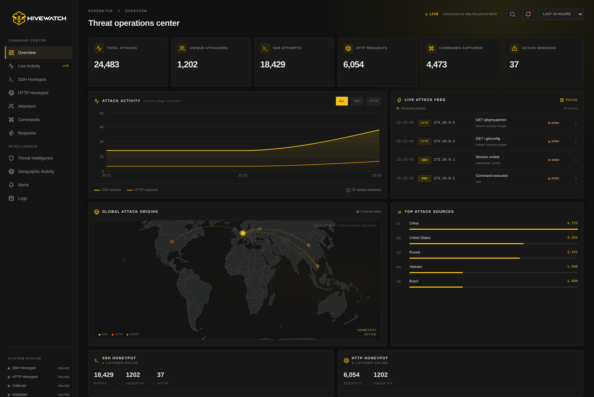

# HiveWatch

A honeypot network with a live threat dashboard. HiveWatch runs fake SSH and HTTP services, records everything attackers do against them, maps their activity to MITRE ATT&CK techniques and streams the results to a web dashboard in real time.

> [!WARNING]
> **This project is not finished.** The core pipeline works end to end (honeypots → processing → database → API → live dashboard), but several dashboard panels still show mock data, some features are missing and the Docker setup is for development only. See [Project status](#project-status) for details.
> Don't expose it to the internet in its current state.



---

## Table of contents

- [Features](#features)
- [Architecture](#architecture)
- [Tech stack](#tech-stack)
- [Getting started](#getting-started)
- [Trying it out](#trying-it-out)
- [API reference](#api-reference)
- [MITRE ATT&CK detection](#mitre-attck-detection)
- [Configuration](#configuration)
- [Project structure](#project-structure)
- [Running tests](#running-tests)
- [Project status](#project-status)

---

## Features

### SSH honeypot
- Accepts **any** username/password and logs every login attempt
- Drops the attacker into a fake Ubuntu 22.04 shell with a small in-memory filesystem
- Supports common recon commands: `ls`, `cd`, `pwd`, `cat`, `whoami`, `id`, `uname`, `echo`, `wget`, `curl`, `exit`
- `wget`/`curl` never download anything; they always fake a DNS failure
- Every command typed is recorded along with session start/end

### HTTP honeypot
- Built on raw `asyncio` sockets instead of a web framework, so malformed requests sent by scanners are still logged instead of rejected
- Serves bait pages for paths bots commonly probe:

  | Path | Response |
  |---|---|
  | `/` | Default Apache "It works!" page |
  | `/wp-login.php`, `/wp-admin/*` | Fake WordPress login form |
  | `/phpmyadmin/*` | Fake phpMyAdmin login |
  | `/xmlrpc.php` | WordPress XML-RPC fault |
  | `/.env` | Fake leaked environment file |
  | `/.git/config` | Fake exposed git config |
  | anything else | Apache 404 page |

- Logs method, path, headers and body (up to 64 KB) for every request
- Pretends to be `Apache/2.4.52 (Ubuntu)`

### Processing pipeline
- **Credential capture**: pulls usernames/passwords out of SSH logins and HTTP login forms (WordPress `log`/`pwd`, `username`/`password`, etc.)
- **GeoIP enrichment**: country/city lookup with MaxMind GeoLite2 (optional)
- **MITRE ATT&CK tagging**: pattern-based rules plus sliding-window detectors for brute force and service scanning
- **Attacker tracking**: each source IP is stored once with first/last seen timestamps
- **Persistence**: everything is saved to PostgreSQL

### Dashboard
- Live attack feed over WebSocket, with pause and SSH/HTTP filter
- Headline stats (total attacks, unique attackers, SSH/HTTP counts, commands captured, active sessions), refreshed every 10s
- Attack activity chart built from live events
- Top attack source countries
- Interactive world map (drag to pan, ctrl + scroll to zoom)

---

## Architecture

The honeypot services, the processing pipeline and the API all run in **one Python process** on a single asyncio event loop. Components talk to each other through an in-memory event bus, so the honeypots don't know anything about the database, and the API doesn't know anything about the honeypots.


1. A honeypot service accepts a connection and publishes a raw `Event` (service, event type, source IP, payload) to the bus.
2. The pipeline picks it up, looks up the IP's location, runs the MITRE detectors, extracts credentials and writes everything to Postgres in one transaction.
3. The enriched event is published to a second bus, which the WebSocket endpoint forwards to connected browsers.
4. The dashboard shows live events from the WebSocket and polls the REST API for aggregate stats.

---

## Tech stack

| Layer | Technologies |
|---|---|
| Backend | Python 3.12, asyncio, FastAPI, asyncssh, asyncpg, Pydantic, geoip2 |
| Database | PostgreSQL 17, Alembic migrations (plain SQL) |
| Frontend | Next.js 16 (App Router), React 19, TypeScript, Tailwind CSS, Recharts, react-simple-maps |
| Tooling | Docker Compose, uv, pytest |

---

## Getting started

### Prerequisites

- [Docker](https://docs.docker.com/get-docker/) and Docker Compose

For running things outside Docker you'll also need Python 3.12+ with [uv](https://docs.astral.sh/uv/) and Node.js 22+.

### 1. Clone the repository

```bash
git clone https://github.com/BoRedo-64/Hivewatch.git
cd Hivewatch
cp .env.example .env
```

### 2. Start the database and run migrations

The backend needs the tables to exist before it starts, so run the migrations first:

```bash
docker compose up -d postgres
docker compose run --rm backend uv run alembic upgrade head
```

### 3. Start everything

```bash
docker compose up --build
```

| Service | URL / port |
|---|---|
| Dashboard | http://localhost:3000 |
| REST API | http://localhost:8000 |
| API docs (Swagger) | http://localhost:8000/docs |
| SSH honeypot | `localhost:2222` |
| HTTP honeypot | http://localhost:8080 |
| PostgreSQL | `localhost:55432` (user/password/db: `hive`) |

### 4. (Optional) Load demo data

To see the dashboard filled with data without waiting for real traffic, load the mock dataset (about 24k fake events from 1,200 fake IPs):

```bash
docker compose exec -T postgres psql -U hive -d hive < scripts/seed_mock_data.sql
```

To wipe it, remove the database volume with `docker compose down -v` and repeat step 2.

### 5. (Optional) Enable GeoIP lookups

GeoIP data comes from MaxMind's free **GeoLite2-City** database, which can't be redistributed, so it's not included.

1. Create a free account at [maxmind.com](https://www.maxmind.com/en/geolite2/signup) and download `GeoLite2-City.mmdb`
2. Copy it into the backend container and restart:

```bash
docker compose cp GeoLite2-City.mmdb backend:/data/GeoLite2-City.mmdb
docker compose restart backend
```

Without it, events are still stored, just without country/city. Note that when testing locally, traffic reaches the container from a private Docker network IP, which never has geo data.

---

## Trying it out

With everything running, open the dashboard at http://localhost:3000 and generate some traffic.

**SSH**: log in with any password and run some commands:

```bash
ssh root@localhost -p 2222
```

```
root@ip-10-0-1-42:/root$ whoami
root@ip-10-0-1-42:/root$ cat /etc/passwd
root@ip-10-0-1-42:/root$ wget http://example.com/bot.sh
```

**HTTP**: hit some of the bait paths:

```bash
curl http://localhost:8080/.env
curl http://localhost:8080/.git/config
curl -X POST -d 'log=admin&pwd=hunter2' http://localhost:8080/wp-login.php
```

Events show up in the live feed straight away. Try 5+ SSH logins within 5 minutes to trigger the brute-force detection, or hit both services within a minute to trigger service discovery.

---

## API reference

Interactive docs are available at http://localhost:8000/docs.

| Method | Endpoint | Description |
|---|---|---|
| `GET` | `/api/health` | Health check |
| `GET` | `/api/events` | Paginated events, newest first. Query params: `limit` (1-200, default 50), `offset`, `ip` |
| `GET` | `/api/sessions` | Paginated SSH sessions with command counts. Query params: `limit`, `offset` |
| `GET` | `/api/stats/overview` | Total events, unique attackers, active sessions, commands captured, events per service |
| `GET` | `/api/stats/countries` | Event count per country. Query param: `limit` (1-50, default 10) |
| `WS` | `/ws/events` | Stream of enriched events as JSON |

Example event from the WebSocket:

```json
{
  "id": 1042,
  "sensor_id": "hive-dev",
  "service": "ssh",
  "event_type": "command",
  "source_ip": "172.19.0.1",
  "session_id": "5b1c8e0a-3f7d-4c55-9a8e-2f0d6e7b4a11",
  "payload": { "command": "cat /etc/passwd" },
  "occurred_at": "2026-09-10T22:13:43.120Z",
  "country": null,
  "city": null,
  "mitre_techniques": ["T1552.001"]
}
```

Event types: `auth_attempt`, `session_start`, `command`, `session_end` (SSH) and `http_request` (HTTP).

---

## MITRE ATT&CK detection

| Technique | Name | Triggered by |
|---|---|---|
| T1110 | Brute Force | 5+ login attempts from the same IP within 5 minutes |
| T1046 | Network Service Scanning | Same IP touches 2+ honeypot services within 60 seconds |
| T1552.001 | Credentials In Files | `cat` on `passwd`, `shadow`, `.ssh/`, `.env`, `id_rsa` |
| T1082 | System Information Discovery | `uname`, `hostname` |
| T1033 | System Owner/User Discovery | `whoami`, `id` |
| T1083 | File and Directory Discovery | `ls`, `pwd`, `find` |
| T1105 | Ingress Tool Transfer | `wget`, `curl` |
| T1053.003 | Scheduled Task/Job: Cron | `crontab` |
| T1595.002 | Vulnerability Scanning | Requests to WordPress, phpMyAdmin, `.env`, `.git` paths |

The sliding-window detectors keep their state in memory, so it resets when the backend restarts.

---

## Configuration

| Variable | Default | Description |
|---|---|---|
| `DATABASE_URL` | *(required)* | PostgreSQL connection string |
| `SENSOR_ID` | `hive-dev` | ID of this honeypot sensor |
| `SSH_PORT` | `2222` | SSH honeypot port |
| `HTTP_PORT` | `8080` | HTTP honeypot port |
| `SSH_HOST_KEY_PATH` | `/data/ssh_host_key` | SSH host key (generated on first start) |
| `GEOIP_DB_PATH` | `/data/GeoLite2-City.mmdb` | GeoLite2 database location |
| `DASHBOARD_ORIGIN` | `http://localhost:3000` | Allowed CORS origin |
| `NEXT_PUBLIC_API_URL` | `http://localhost:8000` | API URL used by the dashboard |

---

## Project structure

```
.
├── backend/
│   ├── app/
│   │   ├── main.py          # App entry point, starts all services
│   │   ├── bus.py           # In-memory pub/sub event bus
│   │   ├── sshd.py          # SSH honeypot
│   │   ├── fakeshell.py     # Fake filesystem and commands
│   │   ├── httpd.py         # HTTP honeypot (raw asyncio)
│   │   ├── http_routes.py   # Bait pages
│   │   ├── pipeline.py      # Event processing
│   │   ├── mitre.py         # ATT&CK detection rules
│   │   ├── geoip.py         # GeoIP lookups
│   │   ├── credentials.py   # Credential extraction
│   │   ├── storage.py       # Postgres queries
│   │   ├── api.py           # REST + WebSocket endpoints
│   │   └── schemas.py       # Pydantic models
│   ├── alembic/             # Database migrations
│   └── tests/
├── dashboard/               # Next.js frontend
│   └── app/page.tsx         # Main dashboard page
├── infra/docker/            # Dev Dockerfiles
├── scripts/
│   └── seed_mock_data.sql   # Demo data
├── docs/
└── docker-compose.yml
```

### Database schema

| Table | Contents |
|---|---|
| `sensors` | Honeypot sensor instances |
| `attackers` | Unique source IPs with location and first/last seen |
| `sessions` | SSH sessions with start/end times |
| `events` | Every event with JSON payload and MITRE techniques |
| `credentials` | Captured username/password pairs |

---

## Running tests

```bash
cd backend
uv sync
uv run pytest
```

Tests cover the event bus, credential extraction, HTTP bait routing and the MITRE detectors, and don't need a database.

---

## Project status

HiveWatch is a **work in progress**.

### Done
- [x] Project setup with Docker Compose
- [x] Database schema and migrations
- [x] In-memory event bus
- [x] SSH honeypot with fake shell
- [x] HTTP honeypot with bait pages
- [x] Processing pipeline (GeoIP, MITRE detection, credential capture)
- [x] REST API and WebSocket
- [x] Dashboard with live feed and real stats

### In progress / known limitations
- [ ] Production Docker setup: the current Compose file is for development (hot reload, source mounted as volumes), and migrations have to be run by hand
- [ ] Several dashboard panels still use **mock data**: the attack map markers, captured commands table, top attackers, security alerts, infrastructure health and the attacker profile drawer
- [ ] Sidebar pages (Live Activity, Attackers, Alerts, Logs, ...) aren't built yet; only the Overview page works
- [ ] Time range selector and search aren't hooked up
- [ ] No authentication on the API or dashboard

### Planned
- [ ] More honeypot services: FTP, SMB, MySQL, Redis
- [ ] MITRE ATT&CK heatmap and a real attack origin map
- [ ] SSH session recording with in-browser replay
- [ ] IOC extraction and STIX 2.1 / blocklist export
- [ ] Rate limiting, dashboard login, production deployment with a reverse proxy

---

## Disclaimer

This project is for educational and research purposes. If you deploy a honeypot on a public network, make sure it's isolated from anything important and that you're allowed to run it on that network.
