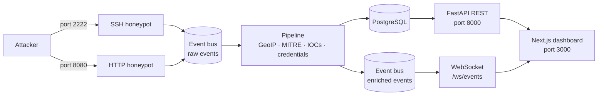

# HiveWatch

A honeypot network with a live threat dashboard. HiveWatch runs fake SSH and HTTP services, records everything attackers do against them, maps their activity to MITRE ATT&CK techniques, extracts indicators of compromise and streams the results to a web dashboard in real time.

> [!WARNING]
> **This project is not finished.** The full pipeline works end to end (honeypots → processing → database → API → live dashboard), and there's a production stack behind a reverse proxy, but there are still rough edges and missing features. See [Project status](#project-status).
> Read [Before you deploy it](#before-you-deploy-it) before putting this on a public network.


*The dashboard running on captured traffic. [See the full page](docs/dashboard-full.png), including the MITRE coverage grid, session replay and IOC export.*

---

## Table of contents

- [Features](#features)
- [Architecture](#architecture)
- [Tech stack](#tech-stack)
- [Quick start](#quick-start)
- [Trying it out](#trying-it-out)
- [API reference](#api-reference)
- [MITRE ATT&CK detection](#mitre-attck-detection)
- [Threat intelligence export](#threat-intelligence-export)
- [Configuration](#configuration)
- [Running in production](#running-in-production)
- [Project structure](#project-structure)
- [Running tests](#running-tests)
- [Project status](#project-status)
- [Before you deploy it](#before-you-deploy-it)

---

## Features

### SSH honeypot
- Accepts any username, but only one password (`SSH_PASSWORD`, default `adminpass`) opens a shell, so failed logins are real and brute-force detection actually has something to detect
- Successful logins get a fake Ubuntu 22.04 shell with a small in-memory filesystem
- Supports common recon commands: `ls`, `cd`, `pwd`, `cat`, `whoami`, `id`, `uname`, `echo`, `wget`, `curl`, `exit`
- `wget`/`curl` never download anything, they just fake a DNS failure
- **Every session is recorded** in [asciicast v2](https://docs.asciinema.org/manual/asciicast/v2/) format and can be replayed in the browser or with any asciinema-compatible player

### HTTP honeypot
- Built on raw `asyncio` sockets instead of a web framework, so the malformed requests scanners send get logged instead of rejected
- Serves bait pages for paths bots commonly probe:

  | Path | Response |
  |---|---|
  | `/` | Default Apache "It works!" page |
  | `/wp-login.php`, `/wp-admin/*` | Fake WordPress login form |
  | `/phpmyadmin/*` | Fake phpMyAdmin login |
  | `/xmlrpc.php` | WordPress XML-RPC fault |
  | `/.env` | Fake leaked environment file |
  | `/.git/config` | Fake exposed git config |
  | anything else | Apache 404 page |

- Logs method, path, headers and body for every request
- Pretends to be `Apache/2.4.52 (Ubuntu)`

### Processing pipeline
- **Credential capture** from SSH logins and HTTP login forms (WordPress `log`/`pwd`, `username`/`password`, and similar)
- **GeoIP enrichment** with MaxMind GeoLite2, including city-level coordinates for the map (optional)
- **MITRE ATT&CK tagging** with pattern rules plus sliding-window detectors for brute force and service scanning
- **IOC extraction**: URLs, domains, IPs, user agents and credential pairs pulled out of events, with a confidence score that rises as indicators repeat
- **Attacker tracking**: each source IP stored once with first/last seen and location
- Everything persisted to PostgreSQL

### Dashboard
- Live attack feed over WebSocket, with pause and SSH/HTTP filtering
- Headline stats and an attack activity chart
- World map of attack origins, using real coordinates where GeoIP resolved them and country centroids otherwise
- **MITRE ATT&CK coverage grid** by tactic, showing techniques that have never fired as well as active ones
- **Session replay** in an xterm.js terminal, with idle gaps compressed
- **IOC panel** with one-click STIX 2.1 and blocklist export
- Top commands, top attackers with a threat score, and alerts from real detections

### Operations
- **One command to start**: migrations run automatically on boot and every setting has a default, so no `.env` is needed
- **Rate limiting** per source IP on both honeypots, to stop one flood from filling the disk
- **Optional API token** for the REST API and WebSocket
- **Production stack** with a separate compose file, nginx reverse proxy, HTTP basic auth, and only the proxy and honeypot ports exposed

---

## Architecture

The honeypot services, the processing pipeline and the API all run in **one Python process** on a single asyncio event loop, connected by an in-memory event bus. The honeypots know nothing about the database, and the API knows nothing about the honeypots.



1. A honeypot service accepts a connection and publishes a raw event to the bus.
2. The pipeline looks up the IP's location, runs the MITRE detectors, extracts indicators and credentials, and writes it all to Postgres in one transaction.
3. The enriched event goes onto a second bus, which the WebSocket endpoint pushes to connected browsers.
4. The dashboard streams live events and polls the REST API for aggregates.

---

## Tech stack

| Layer | Technologies |
|---|---|
| Backend | Python 3.12, asyncio, FastAPI, asyncssh, asyncpg, Pydantic, geoip2, stix2 |
| Database | PostgreSQL 17, Alembic migrations (plain SQL) |
| Frontend | Next.js 16 (App Router), React 19, TypeScript, Tailwind CSS, Recharts, react-simple-maps, xterm.js |
| Infrastructure | Docker Compose, nginx, uv, pytest |

---

## Quick start

You only need [Docker](https://docs.docker.com/get-docker/) and Docker Compose.

```bash
git clone https://github.com/bichiouyahya/Hivewatch.git
cd Hivewatch
docker compose up -d --build
```

That's the whole setup. Migrations run on first boot and every setting has a working default, so no config file is needed. Copy `.env.example` to `.env` only if you want to change something.

| Service | URL / port |
|---|---|
| Dashboard | http://localhost:3000 |
| REST API | http://localhost:8000 |
| API docs (Swagger) | http://localhost:8000/docs |
| SSH honeypot | `localhost:2222` |
| HTTP honeypot | http://localhost:8080 |
| PostgreSQL | `localhost:55432` |

Startup order is handled for you: Postgres becomes healthy, the backend migrates and passes its healthcheck, then the dashboard starts.

### Demo data (optional)

To fill the dashboard without waiting for traffic, load about 24k fake events from 1,200 fake IPs:

```bash
docker compose exec -T postgres psql -U hive -d hive < scripts/seed_mock_data.sql
```

Remove it again, leaving real captured traffic in place:

```bash
docker compose exec -T postgres psql -U hive -d hive < scripts/purge_mock_data.sql
```

### GeoIP (optional)

Country, city and map coordinates come from MaxMind's free **GeoLite2-City** database, which can't be redistributed, so it isn't included.

1. Sign up at [maxmind.com](https://www.maxmind.com/en/geolite2/signup) and download `GeoLite2-City.mmdb`
2. Copy it into the backend container and restart:

```bash
docker compose cp GeoLite2-City.mmdb backend:/data/GeoLite2-City.mmdb
docker compose restart backend
```

Without it everything still works, just with no geography. Local testing never resolves anyway, since traffic arrives from a private Docker network address.

---

## Trying it out

With the stack running, open http://localhost:3000 and generate some traffic.

**SSH** (password `adminpass`, any username):

```bash
ssh root@localhost -p 2222
```

```
root@ip-10-0-1-42:/root$ whoami
root@ip-10-0-1-42:/root$ cat /etc/passwd
root@ip-10-0-1-42:/root$ wget http://example.com/bot.sh
```

Log out and the session appears in the SSH SESSION REPLAY panel, where you can play back exactly what was typed.

**HTTP**:

```bash
curl http://localhost:8080/.env
curl http://localhost:8080/.git/config
curl -X POST -d 'log=admin&pwd=hunter2' http://localhost:8080/wp-login.php
```

Events appear in the live feed immediately. Try a few wrong SSH passwords in a row to trigger brute-force detection, or hit both services within a minute to trigger service discovery.

---

## API reference

Interactive docs at http://localhost:8000/docs.

| Method | Endpoint | Description |
|---|---|---|
| `GET` | `/api/health` | Health check (always open, used by the container healthcheck) |
| `GET` | `/api/events` | Paginated events. Params: `limit`, `offset`, `ip` |
| `GET` | `/api/sessions` | Paginated SSH sessions with command counts |
| `GET` | `/api/sessions/{id}/replay` | Raw asciicast v2 recording of a session |
| `GET` | `/api/iocs` | Extracted indicators. Param: `ioc_type` |
| `GET` | `/api/iocs/export/stix` | STIX 2.1 bundle |
| `GET` | `/api/iocs/export/blocklist` | Param: `format=plain\|iptables\|nginx\|csv` |
| `GET` | `/api/stats/overview` | Totals, active sessions, events in the last minute |
| `GET` | `/api/stats/commands` | Most-run commands with techniques |
| `GET` | `/api/stats/attackers` | Top attackers with a threat score |
| `GET` | `/api/stats/countries` | Event counts per country |
| `GET` | `/api/stats/origins` | Attacker coordinates for the map |
| `GET` | `/api/alerts` | Recent events that tripped a detection rule |
| `GET` | `/api/mitre/heatmap` | Detection counts per technique, grouped by tactic |
| `WS` | `/ws/events` | Live stream of enriched events |

Example event from the WebSocket:

```json
{
  "id": 1042,
  "sensor_id": "hive-dev",
  "service": "ssh",
  "event_type": "command",
  "source_ip": "172.19.0.1",
  "session_id": "5b1c8e0a-3f7d-4c55-9a8e-2f0d6e7b4a11",
  "payload": { "command": "cat /etc/passwd" },
  "occurred_at": "2026-09-24T22:13:43.120Z",
  "country": null,
  "city": null,
  "mitre_techniques": ["T1552.001"]
}
```

Event types: `auth_attempt`, `session_start`, `command`, `session_end` (SSH) and `http_request` (HTTP).

If `API_TOKEN` is set, send it as `Authorization: Bearer <token>`, or as `?token=<token>` where a header isn't possible (download links, the WebSocket).

---

## MITRE ATT&CK detection

| Technique | Name | Triggered by |
|---|---|---|
| T1110 | Brute Force | 5+ login attempts from one IP within 5 minutes |
| T1046 | Network Service Scanning | One IP touching 2+ services within 60 seconds |
| T1552.001 | Credentials In Files | `cat` on `passwd`, `shadow`, `.ssh/`, `.env`, `id_rsa` |
| T1082 | System Information Discovery | `uname`, `hostname` |
| T1033 | System Owner/User Discovery | `whoami`, `id` |
| T1083 | File and Directory Discovery | `ls`, `pwd`, `find` |
| T1105 | Ingress Tool Transfer | `wget`, `curl` |
| T1053.003 | Scheduled Task/Job: Cron | `crontab` |
| T1595.002 | Vulnerability Scanning | Requests to WordPress, phpMyAdmin, `.env`, `.git` paths |

The coverage grid on the dashboard shows all of these grouped by tactic, including ones that have never fired, so it reads as what the sensor can detect rather than only what happened.

Sliding-window state is kept in memory, so it resets when the backend restarts.

---

## Threat intelligence export

Captured indicators can leave the system in formats other tools understand:

- **STIX 2.1** bundle built with the OASIS `stix2` library, so the output is spec-valid rather than hand-rolled JSON
- **Blocklists** in `plain`, `iptables`, `nginx` and `csv` formats

```bash
curl http://localhost:8000/api/iocs/export/stix
curl 'http://localhost:8000/api/iocs/export/blocklist?format=iptables'
```

Blocklists contain IP indicators only, since a firewall can't block a user agent. Credentials are left out of STIX because there's no honest STIX pattern for a guessed username/password pair; they're still available from `/api/iocs`.

---

## Configuration

Everything has a default. Copy `.env.example` to `.env` to override.

| Variable | Default | Description |
|---|---|---|
| `POSTGRES_USER` / `POSTGRES_PASSWORD` / `POSTGRES_DB` | `hive` | Database credentials |
| `POSTGRES_PORT` | `55432` | Database port on the host |
| `API_PORT` | `8000` | REST API port |
| `SSH_HONEYPOT_PORT` | `2222` | SSH honeypot port |
| `HTTP_HONEYPOT_PORT` | `8080` | HTTP honeypot port |
| `DASHBOARD_PORT` | `3000` | Dashboard port |
| `SENSOR_ID` | `hive-dev` | Name of this sensor |
| `SSH_PASSWORD` | `adminpass` | The one SSH password that opens a shell |
| `RATE_LIMIT_PER_MINUTE` | `120` | Connections per source IP per minute |
| `API_TOKEN` | *(empty)* | Bearer token for `/api/*`. Empty leaves the API open |
| `GEOIP_DB_PATH` | `/data/GeoLite2-City.mmdb` | GeoLite2 database location |
| `DASHBOARD_ORIGIN` | `http://localhost:3000` | Allowed CORS origin |
| `NEXT_PUBLIC_API_URL` | `http://localhost:8000` | API URL used by the browser |

---

## Running in production

`compose.prod.yml` builds real images (no bind mounts, no hot reload), restarts containers automatically, and puts nginx in front of everything with HTTP basic auth. Only nginx and the honeypot ports are published, so the API and dashboard can't be reached directly.

```bash
# 1. Password file for basic auth
docker run --rm httpd:2.4-alpine htpasswd -nbB admin 'your-password' > infra/nginx/.htpasswd

# 2. Required settings
echo "POSTGRES_PASSWORD=$(openssl rand -hex 16)" >> .env
echo "PUBLIC_URL=http://your-host:8088" >> .env

# 3. Start
docker compose -f compose.prod.yml up -d --build
```

Everything is then served from one origin at `PUBLIC_URL` (port 8088 by default): the dashboard, the API and the WebSocket.

Notes:
- `NEXT_PUBLIC_*` values are baked in at build time, so rebuild the dashboard image if the public URL changes.
- The backend runs a single uvicorn worker on purpose. The honeypot listeners live inside the process, so extra workers would fight over the same ports. Scale by running more sensors instead.
- The production stack uses its own Compose project name and its own volumes, so it won't attach to the development database.

---

## Project structure

```
.
├── backend/
│   ├── app/
│   │   ├── main.py          # Entry point, starts all services, API auth
│   │   ├── bus.py           # In-memory pub/sub event bus
│   │   ├── sshd.py          # SSH honeypot
│   │   ├── fakeshell.py     # Fake filesystem and commands
│   │   ├── asciicast.py     # Session recorder
│   │   ├── httpd.py         # HTTP honeypot (raw asyncio)
│   │   ├── http_routes.py   # Bait pages
│   │   ├── ratelimit.py     # Per-source sliding window limiter
│   │   ├── pipeline.py      # Event processing
│   │   ├── mitre.py         # ATT&CK catalog and detection rules
│   │   ├── ioc.py           # Indicator extraction
│   │   ├── intel.py         # STIX 2.1 and blocklist export
│   │   ├── geoip.py         # GeoIP lookups
│   │   ├── credentials.py   # Credential extraction
│   │   ├── storage.py       # Postgres queries
│   │   ├── api.py           # REST + WebSocket endpoints
│   │   └── schemas.py       # Pydantic models
│   ├── alembic/             # Database migrations
│   └── tests/
├── dashboard/
│   └── app/
│       ├── page.tsx         # Dashboard
│       └── SessionReplay.tsx # xterm.js replay player
├── infra/
│   ├── docker/              # Dockerfiles and entrypoints
│   └── nginx/               # Reverse proxy config
├── scripts/                 # Demo data seed and purge
├── docker-compose.yml       # Development stack
└── compose.prod.yml         # Production stack
```

### Database schema

| Table | Contents |
|---|---|
| `sensors` | Honeypot sensor instances |
| `attackers` | Unique source IPs with location and coordinates |
| `sessions` | SSH sessions, including the recording |
| `events` | Every event with JSON payload and MITRE techniques |
| `credentials` | Captured username/password pairs |
| `iocs` | Extracted indicators with hit count and confidence |

---

## Running tests

```bash
cd backend
uv sync
uv run pytest
```

56 tests covering the event bus, credential extraction, HTTP bait routing, MITRE detection, IOC extraction, intel export and rate limiting. No database needed.

---

## Project status

HiveWatch works end to end, but it's still a work in progress.

### Done
- SSH honeypot with fake shell, password gate and session recording
- HTTP honeypot with bait pages
- Processing pipeline: GeoIP, MITRE detection, credential capture, IOC extraction
- REST API, WebSocket, and a dashboard running entirely on real captured data
- MITRE coverage grid, attack map, session replay, STIX and blocklist export
- Rate limiting, optional API token, nginx production stack
- One-command startup with automatic migrations

### Known limitations
- **Only SSH and HTTP** are emulated. FTP, SMB, MySQL and Redis are the obvious next ones
- **Geography needs a GeoLite2 database.** The map, country panel and coordinates are all wired up and fill in as soon as one is supplied, but it can't be bundled because of its licence
- **Auth is a shared secret or basic auth**, not user accounts with roles
- Sidebar pages other than Overview aren't built yet
- The time range selector and the search box aren't wired up
- Detection state (brute force windows) is in memory, so it resets on restart

---

## Before you deploy it

A honeypot is meant to be attacked, so treat the host as untrusted.

- **Isolate it.** Run it on a machine or network with nothing else of value on it.
- **Change `SSH_PASSWORD`.** The default is public in this repo. For a honeypot an easy password is arguably the point, but it isn't a secret.
- **Set `POSTGRES_PASSWORD`.** The development stack defaults to `hive`/`hive`; the production stack refuses to start without a real one.
- **Create your own `infra/nginx/.htpasswd`.** It's gitignored and no password file ships with this repo.
- **Set `API_TOKEN`** if you publish the API port directly instead of going through the proxy.
- **Don't rely on a host firewall.** Docker publishes ports in a way that often bypasses `ufw` rules.
- **Don't run `scripts/purge_mock_data.sql` on a public deployment.** It identifies demo rows by their public IPs, and real attackers have public IPs too.

---

## Disclaimer

This project is for education and research. If you run it on a public network, make sure you're allowed to and that it's isolated from anything that matters.
